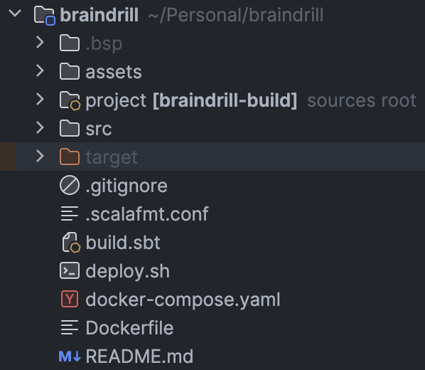

_by [Anzori (Nika) Ghurtchumelia](https://github.com/ghurtchu)_

## 1. Introduction

It's been a long time since my last article, but I am back with greater passion and energy to explore and learn more about the existing tools within Scala ecosystem by building something tangible and useful with them.

The greatest benefit of small side projects is the unique knowledge boost which can potentially be handy later in career.

In this article we will attempt to build the remote code execution engine - the backend platform for websites such as [Hackerrank](https://hackerrank.com), [Leetcode](https://leetcode.com) and others.

If, for some reason you're unfamiliar with the websites mentioned above, the basic usage flow is described below:
- Client sends code
- Backend runs it and responds with output

There you go, sounds simple, right?

Right, right... 

Can you imagine how many things can go wrong here? It's the devil smirking in the corner, knowing, that the possibilities for failure are endless, however, we will address some of them.

To give you a quick idea: a separate blog post can be written only about the security, not to mention scalability, extensibility and a few other compulsory properties to make it production ready.

The goal isn't to build the best one, nor it is to compete with the existing ones. 

Put simply, the goal of this project is to get familiar with `Pekko` and its modules such as `pekko-http`, `pekko-stream`, `pekko-cluster` and a few interesting concepts revolving around actor model concurrency, such as: 
- cluster nodes and formation
- cluster aware routers
- remote worker actors
- actor lifecycle and hierarchy
- actor supervision strategies
- actor location transparency
- message serialization
- and so on...

Let's get started then, shall we?

## 2. Project Structure

We will use `Scala 3.4.1`, `sbt 1.9.9`, `docker`, `pekko` and its modules to complete our project.

The initial project skeleton looks like the following:



- `assets` folder contains images mainly for setting up good `README.md`
- `src` contains production and test code
- `target` will store the compiled `.jar` file that we will run later
- `.gitignore` for `git` to ignore some changes
- `.scalafmt.conf` for formatting Scala code
- `build.sbt` for defining build steps, external library dependencies and so on
- `deploy.sh` is a useful script for deploying the project locally within using `docker-compose`
- `docker-compose.yaml` for defining apps, their configuration and properties
- `Dockerfile` blueprint for running the app inside container
- `README.md` instructions for setting up the project locally

Nothing fancy, let's move on `build.sbt`:
```scala
ThisBuild / scalaVersion := "3.4.1"

val PekkoVersion = "1.0.2"
val PekkoHttpVersion = "1.0.1"
val PekkoManagementVersion = "1.0.0"

assembly / assemblyMergeStrategy := {
  case PathList("META-INF", "versions", "9", "module-info.class") => MergeStrategy.discard
  case PathList("module-info.class")                              => MergeStrategy.discard
  case x =>
    val oldStrategy = (assembly / assemblyMergeStrategy).value
    oldStrategy(x)
}

libraryDependencies ++= Seq(
  "org.apache.pekko" %% "pekko-actor-typed" % PekkoVersion,
  "org.apache.pekko" %% "pekko-stream" % PekkoVersion,
  "org.apache.pekko" %% "pekko-http" % PekkoHttpVersion,
  "org.apache.pekko" %% "pekko-cluster-typed" % PekkoVersion,
  "org.apache.pekko" %% "pekko-serialization-jackson" % PekkoVersion,
  "ch.qos.logback" % "logback-classic" % "1.5.6"
)

lazy val root = (project in file("."))
  .settings(
    name := "braindrill",
    assembly / assemblyJarName := "braindrill.jar",
    assembly / mainClass := Some("BrainDrill")
  )
```

As shown:
- we mainly use `pekko` libraries for main work and `logback-classic` for logging
- `root` definition which defines the `name`, `assemblyJarName` and `mainClass`
- all of which is used by `sbt assembly` to turn our code into `braindrill.jar`

and a one line definition in `project/plugins.sbt`:
```scala
addSbtPlugin("com.eed3si9n" % "sbt-assembly" % "2.1.1") // SBT plugin for using assembly command
```

## 3. Project Architecture