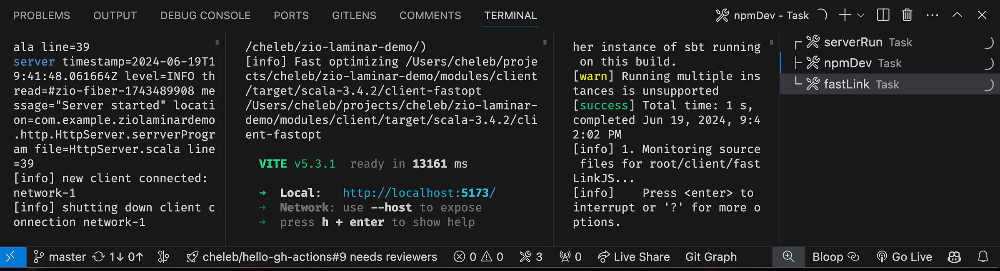
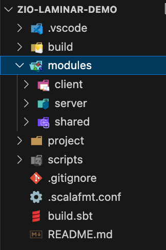
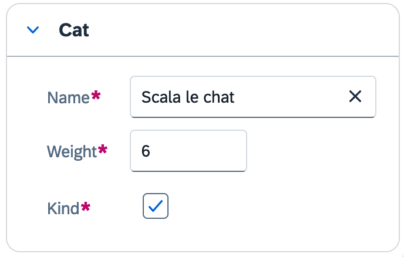

_by [Olivier NOUGUIER](https://github.com/cheleb)_

> This article showcases Olivier's template of a Scala full-stack web application with ZIO and Laminar, after he completed the giant [ZIO Rite of Passage](https://rockthejvm.com/p/zio-rite-of-passage) course on Rock the JVM. The course teaches you to build a full-blown product from scratch with the principles outlined in the article. If this sounds exciting, check it out [here](https://rockthejvm.com/p/zio-rite-of-passage).

In this article, we will show a full-stack web application with Scala and ZIO. This application will expose a REST API to register a person, and will display the registered user in a reactive UI. It will leverage the Scala ecosystem to build a full stack web app in a type safe manner, extensively using Scala `derive` and `extension` mechanism.


Building a full stack web application using the same language has been a never-ending quest.

In general, dynamically typed languages and their loosely compilation guarantees are hard to compete with because of:

* easy setup
* isomorphic by nature, no need for translation between back and front payload
* quick feedback loop, "just hit reload"

On the opposite side, statically typed languages are perceived with somewhat good reason as pachyderm on a wire, where static code guarantees are eclipsed by:
* convoluted setup
* polyglot applications, and payload conversion (eg: Scala/Java -> Json)
* slow feedback during development

In this article, I will demonstrate you how the Scala ecosystem changed the game for me.

Without compromising type safety guarantees of Scala and in the meantime being able to embed library from JavaScript/TypeScript ecosystem.

## 1. Prerequisites:

* **Sbt**: The build tool
* **NodeJS**: The JavaScript runtime
* **Docker**: For the database
* **VSCode**: The editor of choice

## 2. What is inside

* **ZIO**: Functional Effect System on both back and front side.
  * Quill for database access.
* **Tapir**: Providing and giving access to a Rest API in a type safe and incredible elegant way.
* **Laminar**: "Simple, expressive, and safe UI library for Scala.js"

The approach is to build a full stack web app with the same language (Scala) on both the client and the server side.

This is a very powerful combination, that allows to build a full stack web app in a type safe manner. And in the meantime we can leverage the JavaScript ecosystem, without compromising type safety, architecture and scalability of the application.

## 3. Setup


Within a single repository, we will set up a multi-modules application using:

* **SBT**, Scala build tool
* **NPM**, Node Package manager
* **Vite**, development and build tool.

For the very impatient, I've cooked a [g8](https://www.foundweekends.org/giter8/scaffolding.html) template 👇:

```bash
sbt new cheleb/zio-scalajs-laminar.g8 --name=zio-laminar-demo
```

This setup is a little complex because it handles:

* Incremental compilation both client and server side.
* Hot reload of UI
* Production packaging

If you are a VSCode / metals user, you might be lucky:
  
```bash
  code zio-laminar-demo
```

Leveraging the [tasks VSCode](https://code.visualstudio.com/docs/editor/tasks) supports, and after a few downloads, your new full stack development environment should look like this:



4 processes are running here:

* Server side:
  * **docker**: Starts a PostgreSQL database in a docker container.
  * **serverRun**: The dev mode hot reloading API [http://localhost:8080/docs/](http://localhost:8080/docs/) with the Swagger.
* Client side:
  * **fastlink**: Scala to JS compilation/transpilation
  * **npmDev**: [http://localhost:5173/](http://localhost:5173/) now serves your client web app in development mode, hot reloading with Vite.

  Visit the [registration from at http://localhost:5173/](http://localhost:5173/demos/scalariform) and register a person, you should see the registered user in the UI.

## 4. The build

In this section, we'll briefly cover the most important details about the project build.

### 4.1. Scala/ScalaJS

Scala build here is driven by SBT in a rather classic way, except for the `shared` project that will be cast in two different worlds `.jvm` and `.js`
Generated build contains documentation on details. Please take a look and don't hesitate to ask question/provide PR on the g8.

For **ScalaJS**

* "org.scala-js"  % "[sbt-scalajs](http://www.scala-js.org/doc/sbt-plugin.html)" % "1.17.0"
* "ch.epfl.scala" % "[sbt-scalajs-bundler](https://scalacenter.github.io/scalajs-bundler/index.html)" % "0.21.1" will bundle the app
* "ch.epfl.scala" % "[sbt-web-scalajs-bundler](https://scalacenter.github.io/scalajs-bundler/getting-started.html#sbt-web)" % "0.21.1" will expose the bundle as classpath resource for sbt-web (websjar).

### 4.2. Cross building
"org.portable-scala" % "[sbt-scalajs-crossproject](https://github.com/portable-scala/sbt-crossproject)" % "1.3.2"

This is the plugin that will allow to spread project resources between JS and JVM worlds.
Shared project configuration 👇

*  Server project aka Scala JVM depends `share.jvm` variant
*  Client project aka Scala JS depends on `shared.js` variant

ScalaJS and ScalaJS bundler are smart enough to cross-compile and deploy `module/shared/src/main/scala` sources in both target.

### 4.3. JS integration

JS integration is also a classical one with NPM and Vite, here a again specific configuration is limited to vite.config.js

```javascript
import { defineConfig } from "vite";
import scalaJSPlugin from "@scala-js/vite-plugin-scalajs";

export default defineConfig({
    plugins: [scalaJSPlugin({
        // path to the directory containing the sbt build
        // default: '.'
        cwd: '../..',    // (1)

        // sbt project ID from within the sbt build to get fast/fullLinkJS from
        // default: the root project of the sbt build
        projectID: 'client', // (2)

        // URI prefix of imports that this plugin catches (without the trailing ':')
        // default: 'scalajs' (so the plugin recognizes URIs starting with 'scalajs:')
        uriPrefix: 'scalajs',
    })],
    build: {
        sourcemap: true,
    },
    // base: "/zio-laminar-demo",

});
```

Where most of the work is achieved by `@scala-js/vite-plugin-scalajs` plugin, which needs to know:

* **(1)** the location of the sbt build and which project to use
* **(2)** the sbt project ID to get fast/fullLinkJS from

During development, the sbt project must be bundled as ESModule. If you are using the g8 template, this is [already the case](https://github.com/cheleb/zio-laminar-demo/blob/master/build.sbt#L97).

In this setup:

* **fastLinkJS** runs the Scala to JS process in watch mode.
* **Vite** will serve the app in http://localhost:5173/ and reload the client automatically.

This setting will allow Vite to hot reload changes on the fly, giving an incredible developer experience.

## 5. Project structure

Thanks to the power of SBT and multi-module support, it easy to compile and package all together.

In VS code you can see the modules view:


<table>
  <tr>
    <td>
     <div>
      
     </div>
     <div>
     VS Code modules view.
     </div>
   </td>
   <td>
    <strong>Client Module</strong>, UI:
   <ul>
    <li>Laminar is the reactive UI</li>
    <li>Sttp client leverages the same Tapir endoint definitions</li>
   </ul>
  <strong>Server</strong> Module, ZIO HTTP: 
  <ul> 
    <li>Tapir ServerEndpoint from shared endpoint definitions.</li>
    <li>Swagger exposition gracefully provided by Tapir http://localhost:8080/docs/</li>
    <li>Prometheus metrics http://localhost:8080/metrics/</li>
  </ul>
  <strong>Shared</strong> module:
    <ul>
      <li>model with Json support</li>
      <li>API endpoint definitions</li>
    </ul>
  </td>
  </tr>
</table>


Sometimes we need to [generate some static files](https://github.com/cheleb/zio-laminar-demo/blob/master/build.sbt#L63), like the index.html of the server module. This is done with SBT only when the server module is build.

Let's see how ZIO, Laminar and Tapir can be combined to build a full stack web app.

## 6. Server side

We will now focus on the server side, but the same principles will apply to the client side. 

We will see how ZIO will combine:

* data access
* services
* Rest API 

### 6.1. ZIO

A library for asynchronous and concurrent programming in Scala. There's a lot to say about it and Rock the JVM teaches this in detail in a [dedicated ZIO course](https://rockthejvm.com/p/zio), but we'll cover the essentials below. 

**ZIO** is a data type that represents an effectful program that when evaluated:
  * will require an element of type `R` to execute
  * may produce a value of type `A`
  * may fail with an error of type `E`

Sometimes an oversimplified mental model is to represent ZIO as:
  
```scala
  type ZIO[R, E, A] = R => Either[E, A]
```

But ZIO is much more than that, it is an extensive library that provides a lot of utilities to handle effects, blocking, concurrency, retry, and so on. Very importantly, ZIO is a monad, and as such it provides a lot of combinators to handle effects, errors and dependencies.

A ZIO aka program, workflow, or effect:

* can be combined with other effects
* can handle errors, returning new effects as result
* will release resources when acquired

At a glance, `ZIO[–R,+E,+A]` uses variance annotations to allow a very convenient constructions like our Server side application:

```scala
object HttpServer extends ZIOAppDefault {

  val runMigrations: ZIO[FlywayService, Throwable, Unit] = [...]              // (1)
  
  val server: ZIO[PersonService & Server, Nothing, Unit] = [...]              // (2)
  
  val program: ZIO[FlywayService & PersonService & Server, Throwable, Unit] = // (4)
    for {
      _ <- runMigrations                                                      // (3)
      _ <- server
    } yield ()

  override def run =
    program
      .provide( // (5)
         Server.default,
        // Service layers
        PersonServiceLive.layer,
        FlywayServiceLive.configuredLayer,
        // Repository layers
        UserRepositoryLive.layer,
        Repository.dataLayer
        // Uncomment to get a mermaid diagram of the dependencies is compilation logs.
        //,       ZLayer.Debug.mermaid 
      )
}
```

* Two ZIO effects are running in this application:
  * **(1)** `runMigrations` is a ZIO[**FlywayService**,…] that depends on a FlywayService, and that will handle the database migrations.
  * **(2)** `server` is a ZIO[**PersonService & Server**,…] that depends on a PersonService and a Server and that will handle the HTTP server.
* Those two effects combine in a for comprehension **(3)** to produce a new ZIO **(4)** that accumulate the dependencies:
 ZIO[**FlywayService & PersonService & Server**,…]

To be runnable, those dependencies need to be satisfied **(5)**. This is what layers are made for. A layer is a ZIO concept that will provide a service, and that can depend on other services. Letțs see how ZIO, assembles the application, one layer after another.

#### 6.1.1. Repository data layer

Repository `datalayer` is the first layer of the application, it abstracts the database access. In this project, a classic Repository object connects the database through a classical JDBC DataSource.

```scala

object Repository {

  private def datasourceLayer: TaskLayer[DataSource] =
                                    Quill.DataSource.fromPrefix("db")            // (1)

  def quillLayer: URLayer[DataSource, Postgres[SnakeCase.type]] =
                                    Quill.Postgres.fromNamingStrategy(SnakeCase) // (2)

  def dataLayer: TaskLayer[Postgres[SnakeCase.type]] =
                                    datasourceLayer >>> quillLayer               // (3)

}
```

* This requires a **(1)** DataSource layer, that will provide a DataSource service from the configuration.
> TaskLayer is a type alias for a ZLayer that does not require a dependency and can fail with a Throwable:
>
>  type **TaskLayer**[+A] = ZLayer[Any, **Throwable**, A]


* The second requirement is **(2)** Quill layer, that will provide a Quill Postgres service, with a SnakeCase naming strategy for the table mapping, this layer depends on the DataSource service.
> **URLayer** is a type alias for a ZLayer that does require a dependency and cannot fail:
>
>  type **URLayer**[-R, +A] = ZLayer[R, **Nothing**, A]


* The third requirement is a **(3)** data layer, that will provide a Quill Postgres service from the DataSource service.

> The `>>>` operator is a ZLayer combinator that will chain the layers. It is a vertical composition of layers, that will provide the service from the first layer to the second layer.
> The `++` operator is a ZLayer combinator that will merge the layers, it is a horizontal composition of layers.
> [This video](https://www.youtube.com/watch?v=PaogLRrYo64) on Rock the JVM's YouTube channel explains layer composition.

ZIO contains a rich variety of type aliases that after a while will make the code very readable.

### 6.1.2. User Repository 

The User Repository is a classic repository that will handle the User entity.

```scala
trait UserRepository:                            // (1)
  def create(user: User): Task[User]
  def getById(id: Long): Task[Option[User]]
 
                                                 // (2)
class UserRepositoryLive private (quill: Quill.Postgres[SnakeCase]) extends UserRepository {

  import quill.*

  inline given SchemaMeta[User] = schemaMeta[User]("users")     // (3)
  inline given InsertMeta[User] = insertMeta[User](_.id)
  inline given UpdateMeta[User] = updateMeta[User](_.id, _.creationDate)

  override def create(user: User): Task[User] =
    run(query[User].insertValue(lift(user)).returning(r => r)) // (4a)
  override def getById(id: Long): Task[Option[User]] =         // (4b)
    run(query[User].filter(_.id == lift(Option(id)))).map(_.headOption)
}

object UserRepositoryLive: // (5)                                        (6)
  def layer: RLayer[Postgres[SnakeCase], UserRepositoryLive] = ZLayer.derive[UserRepositoryLive]

```

* **(1)** Repository trait
* **(2)** Repository implementation, with Quill Postgres injection
* **(3)** Quill Meta, to map the User case class to the users table
* **(4)** Quill queries
* **(5)** Repository layer
* **(6)** One of the many ZIO macro that will generate the layer for you, from the constructor of the class (2).


> Note how `ZLayer.derive[UserRepositoryLive]` is used to generate the layer from the constructor of the class, and how this layer is then depends on the `Postgres[SnakeCase]`.

Quill is a compile-time query language for Scala and SQL. It allows to write queries in Scala and compile them to SQL.

Quill compiles **(4a)** and **(4b)** to SQL like this:

```sql
INSERT INTO users (name,email,age,creation_date) VALUES (?, ?, ?, ?) RETURNING id, name, email, age, creation_date;
SELECT x4.id, x4.name, x4.email, x4.age, x4.creation_date AS creationDate FROM users x4 WHERE x4.id IS NULL AND ? IS NULL OR x4.id = ?;
```

### 6.1.3. Flyway Service

In the same way, Flyway service is a layer that will handle the database migrations.

```scala
object FlywayServiceLive {

  private val DATASOURCE_PATH = "db"

  def live: RLayer[FlywayConfig, FlywayService] = ZLayer( // (1)
    for {
      config <- ZIO.service[FlywayConfig]
      flyway <- ZIO.attempt(Flyway.configure()
                   .dataSource(config.url, config.user, config.password).load())
    } yield new FlywayServiceLive(flyway)
  )

  val configuredLayer: TaskLayer[FlywayService] = Configs.makeConfigLayer[FlywayConfig](DATASOURCE_PATH) 
                                                             >>> live  // (2)
}
```
  
* **(1)** is a layer that will provide a **FlywayService**, it depends on the availability of **FlywayConfig** service.
* **(2)** Inject a **FlywayConfig** in a the previous layer and the remove the dependency on the config.

#### 6.1.4. Person Service

Person service is a layer that will handle the business logic of the application. It may for example validate the data before calling the repository.

In this example, the PersonService will check if the person is older than 18 before registering it, and will fail with a **TooYoungException** if not. 

> **Task** is a type alias for a ZIO that can fail with a Throwable:
>
>  `type **Task**[A] = ZIO[Any, **Throwable**, A]`


```scala
trait PersonService {             // Service trait
  def register(person: Person): Task[User]
}
                                  // Dependency injection
class PersonServiceLive private (userRepository: UserRepository) extends PersonService {
  def register(person: Person): Task[User] =
    if person.age < 18 then ZIO.fail(TooYoungException(person.age))
    else userRepository.create(
      User(
        id = None,
        name = person.name,
        email = person.email,
        age = person.age,
        creationDate = ZonedDateTime.now()
      )
    )
}

object PersonServiceLive {           // Layer derivation (macro) from the constructor
  val layer: RLayer[UserRepository, PersonService] = ZLayer.derive[PersonServiceLive]
}
```

This is a very simple service, but it could be more complex, and could depend on other services. One of the power of ZIO is to be able to combine services in a very elegant way, for example, let say that the PersonService depends on another Service like a NotificationService, it could be done like this:

```scala
class PersonServiceLive private (userRepository: UserRepository, notificatonService: NotificationService) extends PersonService {
  def register(person: Person): Task[User] =
    if person.age < 18 then ZIO.fail(TooYoungException(person.age))
    else for {
      user <- userRepository.create(
        User(
          id = None,
          name = person.name,
          email = person.email,
          age = person.age,
          creationDate = ZonedDateTime.now()
        )
      )
      _ <- notificatonService.notify(user)
    } yield user
}
```

And the layer would be derived from the constructor, without any additional code:

```scala
object PersonServiceLive:
  val layer: RLayer[UserRepository & NotificationService, PersonService] =
     ZLayer.derive[PersonServiceLive]
```

Lifting a new dependency in the service is just a matter of adding it to the constructor, and the layer will be derived from the constructor. In this case, we would need to provide the NotificationService in the main program, and the PersonService would be able to use it.

This is really powerful, convenient during development, and efficient at runtime &mdash; a truly modular and scalable application.

#### 6.1.5. Server layer

The Server layer is a layer that will handle the HTTP server. It is provided by ZIO HTTP with convenient default configuration.

It is a dependency that will be provided to the server effect.

```scala
private val server: ZIO[PersonService & Server, IOException, Unit] =
    for {
      _            <- Console.printLine("Starting server...")
      apiEndoints  <- HttpApi.endpointsZIO        // (1)
      docEndpoints = SwaggerInterpreter()         // (2)
                       .fromServerEndpoints(endpoints, "zio-laminar-demo", "1.0.0")
      _            <- Server.serve(               // (3)
             ZioHttpInterpreter(serverOptions)
               .toHttp(metricsEndpoint :: webJarRoutes :: endpoints ::: docEndpoints) 
                                                  // (4)
           )
    } yield ()
```

This is a ZIO effect that will:

* **(1)** gather the API endpoints from the HttpApi
* **(2)** generate the documentation endpoints from the apiEndoints
* **(3)** start the server, and serve the all endpoints.
* **(4)** metrics, webjar routes, endpoints and documentation endpoints are served by the server.

> The `::` and `:::` are List concatenation operators, `::` is for a single element, `:::` is for a list of elements, with right-associativity.
>
> `(metricsEndpoint :: (webJarRoutes :: (apiEndpoints ::: docEndpoints)))`
>
> Quite a Scala idiom, that will allow to build a list of elements in a very readable way.
>
> Hence, `metricsEndpoint :: webJarRoutes :: endpoints ::: docEndpoints` is a list of endpoints.

The endpoints are a combination of the metrics endpoint, the webjar routes, the API endpoints and the documentation endpoints.

```scala
object HttpApi {
  private def gatherRoutes(
    controllers: List[BaseController]
  ): List[ServerEndpoint[Any, Task]] =
    controllers.flatMap(_.routes)

  private def makeControllers: URIO[PersonService, List[BaseController]] = for {
    healthController <- HealthController.makeZIO
    personController <- PersonController.makeZIO
  } yield List(healthController, personController)

  val endpointsZIO: URIO[PersonService, List[ServerEndpoint[Any, Task]]] =
                makeControllers.map(gatherRoutes)
}

```

And last part of puzzle, PersonController that will provide the API endpoints.

As it leverages Tapir, see next section [Tapir server side](#62-server-side) for more details.

In the meantime, enjoy the Mermaid [diagram of the dependencies](https://mermaid-js.github.io/mermaid-live-editor/edit/#eyJjb2RlIjoiZ3JhcGggQlRcbkwwKFwiU2VydmVyLmRlZmF1bHRcIilcbkwxKFwiUmVwb3NpdG9yeS5kYXRhTGF5ZXJcIikgLS0+IEwyKFwiVXNlclJlcG9zaXRvcnlMaXZlLmxheWVyXCIpXG5MMVxuTDIgLS0+IEwzKFwiUGVyc29uU2VydmljZUxpdmUubGF5ZXJcIilcbkw0KFwiRmx5d2F5U2VydmljZUxpdmUuY29uZmlndXJlZExheWVyXCIpIiwibWVybWFpZCI6ICJ7XCJ0aGVtZVwiOiBcImRlZmF1bHRcIn0ifQ==) compiled by ZIO.

## 7. Tapir

Tapir is a library for defining API endpoint as immutable data structures.

This is a huge win, because it allows us to:

* define the API once
* generate the client and server side
* generate the documentation
* test the controller in an isolated way

Here is an example of a Tapir endpoint definition:

### 7.1. Shared Endpoint definitions

In the shared module, the API endpoints are defined as immutable data structures.

```scala
object PersonEndpoints {
  val get: Endpoint[Unit, Unit, String, Person, Any] = endpoint.get
    .in("person")
    .out(jsonBody[Person])
    .errorOut(stringBody)
    .summary("Get a person by id")

  val create: Endpoint[Unit, Person, Throwable, User, Any] = baseEndpoint
    .tag("person")
    .name("person")
    .post
    .in("person")
    .in(
      jsonBody[Person]                                         // (1)
        .description("Person to create")
        .example(Person("John", 30, Left(Cat("Fluffy"))))
    )
    .out(jsonBody[User])
    .description("Create person")

}
```

This is a simple GET endpoint that will return a Person and a POST endpoint that will create a Person and return a User.

From this definition, Tapir will help generate the client and server side code, the documentation and the tests.

### 7.2. Server side

On the **server side**, Tapir `Endpoints.create` will be implemented by a ZIO effect, through the **zServerLogic** combinator.

```scala
                                           // (1)
class PersonController private (personService: PersonService) extends BaseController {
  [...]

  val create: ServerEndpoint[Any, Task] = PersonEndpoint.createEndpoint
    .zServerLogic(                                                // (2)
      p => personService.register(p)
    )

  val routes: List[ServerEndpoint[Any, Task]] =
    List(create, get, ...)                                        // (3)
}

object PersonController {
  def makeZIO: URIO[PersonService, PersonController] =            // (4)
    ZIO.service[PersonService]                                    // (4a)
      .map(personSevice => new PersonController(personService))   // (4b)
}

```

Here are the important bits:

* **(1)** Dependency Injection.
* **(2)** Controller implementation, where json codec are transparently handled by Tapir:
  * `p: Person` is the payload of the request as describe in the endpoint definition.
  * `personService.register(p)` is the ZIO effect that will register the person.
* **(3)** List of endpoints that will be served by the controller.
* **(4)** Service instantiation:  URIO[PersonService, PersonController]
  * **(4a)** Get the PersonService from the environment.
  * **(4b)** Instantiate the PersonController with the PersonService.


Everything is described as ZIO effects. `URIO[PersonService, PersonController]` is a ZIO that needs a PersonService and will produce a PersonController and cannot fail.

> **URIO** is a type alias for a ZIO that cannot fail:
>
>  `type URIO[R, A] = ZIO[R, Nothing, A]`

**zServerLogic** is part of the Tapir ZIO support, and bridges a ZIO in the Rest API. Itis a combinator that will transform a ZIO effect into a server logic, it will handle the error and the success case.

Tapir provides a [lot of combinators](https://tapir.softwaremill.com/en/latest/server/logic.html#other-server-logic-variants) to handle the ZIO effect, Cats Effect or Future.

### 7.3. Client side

On the **client side**, Tapir will allow to interact as client, it will leverage the same endpoint definition to generate the client side code.

It will smartly generate the client side code, that will be used in the Laminar UI.

## 8. Laminar 

[Laminar](https://laminar.dev) is a 100% Scala reactive UI library. In few words, Laminar provides reactive variables and events that can be watched and consumed in the UI:

* **Signal**, to watch an unique element
* **EventStream**, to consume stream of events
* **Var**: to watch and update an element
* **EventBus**: to consumes and produces events.

Laminar also provides Dom manipulation facilities, and bindings to WebComponent libraries (UI5 in this example).

In this example, I use [LaminarSAPUI5Bindings](https://github.com/sherpal/LaminarSAPUI5Bindings) and Magnolia to [derive HTML forms]((https://cheleb.github.io/laminar-form-derivation/docs/index.html)) from a case class.

```scala
import dev.cheleb.scalamigen.*
import com.raquo.laminar.api.L.*

case class Cat(name: String, weight: Int, kind: Boolean = true)

val catVar = Var(Cat("Scala le chat", 6))

catVar.asForm
```

Et voilà, a form is derived from the case class, and can be rendered in the UI.




### 8.1 Http client, unsecured and secured

On the **client side**, Tapir will allow to interact as client, is a very straightforward way: 

```scala
 Button(
  "-- Post -->",
  onClick --> { _ =>     // (1)
    PersonEndpoint       // (2)
      .createEndpoint(
        personVar.now()  // (2a)
      )                  // (2b)
      .emitTo(           // (3a)
        userBus          // (3b)
      ) 
  }
)
```

We have:
* **(1)** the handling of a Laminar UI event
* **(2)** a HTTP endpoint
  * **(2a)** reads the current value of a Laminar Var
  * **(2b)** turns into ZIO effect to handle the HTTP request
* **(3)** an effect that, when evaluated
  * **(3a)** will push its value to an event bus
  * **(3B)** which is consumed by the Laminar UI

This is a lot of magic in a single line!

In the same way that on server side **zServerLogic** bridges ZIO in Tapir through an extension method, on client side two extension methods are used:
* From laminar to ZIO
* From ZIO back to Laminar

This is the power of Scala 3 extension methods, that allows to extend existing classes with new methods.

A first extension, turns this endpoint value into a function:

```scala
extension [I, E <: Throwable, O](endpoint: Endpoint[Unit, I, E, O, Any])
    /**
     * Call the endpoint with a payload, and get a ZIO back.
     * @param payload
     * @return
     */
    def apply(payload: I): RIO[BackendClient, O] =
      ZIO.service[BackendClient]
        .flatMap(_.endpointRequestZIO(endpoint)(payload))
```

When called, this turns the enhanced endpoint to a function that:

* can take arbitrary input **I**
* can use a provided  **BackendClient**
* and will produce a ZIO effect producing an arbitrary output **O**

Simply said, with this extension in scope, now createEndpoint can be used as a function:

```scala
def createEndpoint[I, O](payload: I): RIO[BackendClient, O]
```

> Note: **RIO** is just a type alias where error are Throwable:
>
> `type RIO[R, A]= ZIO[R, Throwable, A]` 

This effect needs a BackendClient to run - look at `ZIO.service[BackendClient]`.

This is what the second extension will satisfy in a glimpse of Scala:

```scala
extension [E <: Throwable, A](zio: ZIO[BackendClient, E, A])
    /**
     * Emit the result of the ZIO to an EventBus.
     *
     * @param bus
     */
    def emitTo(bus: EventBus[A]): Unit =
      Unsafe.unsafe { implicit unsafe =>                           // (1)
        Runtime.default.unsafe.fork(                               // (2)
          zio
            .tapError(e => Console.printLineError(e.getMessage())) // (3)
            .tap(a => ZIO.attempt(bus.emit(a)))                    // (4)
            .provide(BackendClientLive.configuredLayer)            // (5)
        )
      }
```


This extension will allow to run the ZIO effect and emit the result to an EventBus.

* **(1)** Unsafe is a ZIO utility to run unsafe code.
* **(2)** Runtime is the ZIO runtime forked (worker maybe ?).
* **(3)** tapError will log the error if any.
* **(4)** tap will emit the result to the EventBus.
* **(5)** provide the BackendClient service to the effect, with a layer.

`BackendClientLive.configuredLayer` is the layer that will provide the BackendClient service, this is where most of the magic happens.

```scala
object BackendClientLive:
  val layer = ZLayer.derive[BackendClientLive]

  val configuredLayer: ULayer[BackendClient] = {
    val backend: SttpBackend[Task, ZioStreams] = FetchZioBackend()
    val interpreter                            = SttpClientInterpreter()
    val config                                 = BackendClientConfig(Some(uri"${Constants.backendBaseURL}"))

    ZLayer.succeed(backend) ++ ZLayer.succeed(interpreter) ++ ZLayer.succeed(config) >>> layer
  }
```

In short term, in this one-liner we:

* open a channel to a Rest API in a full type safe manner
* serialised the case class to a JSON payload
* wait for the result.
* piped the deserialized result in UI.

### 8.2. Secured Endpoint

In the same way, a secured client can be defined, that will handle the authentication and the authorization.

Of course, it will be a bit more complex, but the same principles will apply.

Tapir does distinguish the secured endpoints from the unsecured ones, and will generate the client side code accordingly.

For example, a secured endpoint will be defined like this:

```scala
val profile: Endpoint[String, Boolean, Throwable, (User, Option[Pet]), Any] = baseEndpoint
    .securityIn(auth.bearer[String]())
    .tag("person")
    .name("profile")
    .get
    .in("profile")
    .in(query[Boolean]("withPet").default(false))
    .out(jsonBody[(User, Option[Pet])])
    .description("Get profile")
```

Notice the first type parameter of the endpoint, it is a String, that will be the token, and that will be used to authenticate the request.

This is a secured endpoint, that will require a bearer token to be called.

#### 8.2.1. Secured Server

The server will need to handle the authentication and the authorization.

In the same way, the secured client will be defined with an extension method that will handle the authentication and the authorization.

```scala
                                  
trait SecuredBaseController[SI, Principal](
    principalExtractor: SI => Task[Principal]                       // (1)
):
  /** Enriches an endpoint with security logic
    */
  extension [I, O, R](endpoint: Endpoint[SI, I, Throwable, O, R])   // (2)
    /** ZIO security logic for a server endpoint
      *
      * Extracts the user principal from
      * the request Security Input, and applies
      *
      * @param logic,
      *   curryied function from user principal
      *   to request to response
      * @return
      */
    @SuppressWarnings(Array("org.wartremover.warts.Any"))
    def securedServerLogic(
        logic: Principal => I => Task[O]                            // (3)
    ): ServerEndpoint[R, Task] =
      endpoint
        .zServerSecurityLogic(principalExtractor)
        .serverLogic(principal => input => logic(principal)(input))

```

This trait will provide an extension method that will handle the authentication and the authorization of the secured endpoint. But in a generic way, that will allow 
to handle any kind of security input and any kind of principal.

* **(1)** principalExtractor is a function that will extract the principal from the Security Input.
* **(2)** extension method that will enrich the endpoint with security logic.
* **(3)** logic is a function that will handle the request and the response, and that will depend on the principal.

Then the controller (server side) will be defined like this:

```scala
class PersonController private (personService: PersonService, jwtService: JWTService)
    extends BaseController
    with SecuredBaseController[String, UserID](jwtService.verifyToken) {    // (1)                


  val profile: ServerEndpoint[Any, Task] = 
    PersonEndpoint.profile.securedServerLogic { userId => withPet =>        // (2)
      personService.getProfile(userId, withPet)
  }
}
```

* **(1)** The controller `extends SecuredBaseController` with the token extractor function: `String => Task[UserID]`.
* **(2)** The curried function that will handle the request and the response, and that will depend on the principal.

One-liners again!

#### 8.2.2. Secured Client

On client side, the secured client will be defined with an extension method that will handle the authentication. Not to brag, but I believe this is the most impressive part of this article (_Daniel here: I agree!_)

Let's see how the secured client will be used in the UI:

```scala
val userBus = new EventBus[(User, Option[Pet])]

def apply() = div(
                child <-- session(                                    // (1)
                  div(h1("Please log in to view your profile"))       // (2)
                )(_ =>
                  div(
                    onMountCallback { _ =>                            // (3)
                      PersonEndpoint.profile(false).emitTo(userBus)   // (4)
                    },
                    h1("Profile Page"),                               // (5)
                    // Display the user profile
```

* **(1)** session is a utility that will handle hold the User state.
* **(2)** If the user is not logged in, display a message.
* **(3)** When the component is mounted, call the secured endpoint.
* **(4)** Emit the result to the EventBus.
 this is because the token is handled another extension method that is triggered by the secured endpoint.
* **(5)** Display the user profile.

The attentive reader will notice that the secured endpoint is called without any token, just like the unsecured endpoint. How is it possible?

This is because the token is handled by the extension method that is triggered by the secured endpoint.

```scala
extension [I, E <: Throwable, O](endpoint: Endpoint[String, I, E, O, Any])    // (1)
  /** Call the secured endpoint with a payload, and get a ZIO back.
    * @param payload
    * @return
    */
  @targetName("securedApply")
  def apply[UserToken <: WithToken](                                          // (2)
      payload: I
  )(using session: Session[UserToken]): RIO[SameOriginBackendClient, O] =     // (3)
    ZIO
      .service[SameOriginBackendClient]
      .flatMap(_.securedEndpointRequestZIO(endpoint)(payload))                // (4)
```

* **(1)** extension method that will enrich the secured endpoint with the token handling.
* **(2)** UserToken is a type that will hold the token (generic), and that will be provided by the session.
* **(3)** The session is a class that will provide access to the UserToken.
* **(4)** The `securedEndpointRequestZIO`is the method which will handle the token through the session and local storage.

### 8.3. Take away on Http client

With this extension methods, secured endpoints can be called in the same way as unsecured endpoints, and the token will be handled in a full type safe manner.

This is part of an [external library](https://github.com/cheleb/zio-laminar-tapir).

## All together

Here is the [full code](https://github.com/cheleb/zio-laminar-demo/blob/master/modules/client/src/main/scala/com/example/ziolaminardemo/app/demos/scalariform/ScalariformDemoPage.scala#L32) of the page that will create a Person and display the registered User in the UI.

```scala
package com.example.ziolaminardemo.app.demos.scalariform

// imports ...


object ScalariformDemoPage:
  def apply() =
    val personVar = Var(Person("Alice", 42, Left(Cat("Fluffy"))))         // (1)
    val userBus   = EventBus[User]()                                      // (2)

    div(
      styleAttr := "width: 100%; overflow: hidden;",
      div(
        styleAttr := "width: 600px; float: left;",
        Form.renderVar(personVar)                                         // (3)
      ),
      div(
        styleAttr := "width: 100px; float: left; margin-top: 200px;",
        Button(
          "-- Post -->",
          onClick --> { _ =>
            // scalafmt:off

            PersonEndpoint                                                // (4)
              .createEndpoint(personVar.now())
              .emitTo(userBus) 

            // scalafmt:on

          }
        )
      ),
      div(
        styleAttr := "width: 600px; float: left;",
        h1("Databinding"),
        child.text <-- personVar.signal.map(p => s"$p"),                  // (5)
        h1("Response"),
        child <-- userBus.events.map(renderUser)                          // (6)
      )
    )

  def renderUser(user: User) =
    div(
      h2("User"),
      div(s"Name: ${user.name}"),
      div(s"Age: ${user.age}"),
      div(s"Pet: ${user.pet}"),
      div(s"Creation Date: ${user.creationDate}")
    )
```

* **(1)** A Laminar Var that will hold the Person to create
* **(2)** An EventBus that will receive the User created
* **(3)** A Form that will bind the Person to the UI see [here](https://cheleb.github.io/laminar-form-derivation/docs/index.html)
* **(4)** A Button that will call the PersonEndpoint.createEndpoint with the current value of the Person Var
* **(5)** A div that will display the current value of the Person Var (debug purpose)
* **(6)** A div that will display the User created, reacting to the EventBus events.

This is a lot of magic in a single page.

## Interacting with JavaScript ecosystem

We can leverage the JavaScript ecosystem in a type safe manner, either by using a Scala.js façade or by using the JavaScript API directly.

To illustrate this, we are using a Laminar binding to a SAP UI5 component. But more interestingly, you will find in the project a façade to the [Chart.js](https://www.chartjs.org/) library.

This is generated by [ScalablyTyped](https://scalablytyped.org/), a tool that will generate Scala.js façades from TypeScript definitions.

This sample is extracted from Sébastien Doeraene demonstration: [Getting started with Scala.js, Laminar and ScalablyTyped](https://www.youtube.com/watch?v=UePrOa_1Am8)

```sbt
addSbtPlugin("org.scalablytyped.converter" % "sbt-converter" % "1.0.0-beta44")
```

Some configuration, devDependencies point to TypeScript whereas runtime dependencies point javascript:
```json
{
  "name": "scalablytyped",
  "private": true,
  "version": "0.0.1",
  "type": "module",
  "dependencies": {
    "chart.js": "2.9.4"
  },
  "devDependencies": {
    "typescript": "5.4.5",
    "@types/chart.js": "2.9.29"
  }
}
```

In this example Chart.js bindings are generated from the TypeScript definition and fully accessible from ScalaJS at compile time, whereas the chart.js will be used at runtime.
Generated classes are pushed in your local (ivy) repo, hence generated only once.

Notice, this package.json is not the application one, because I want to limit this binding generation to strictly necessary.

Then you can refer to TypeScript library very easily, see [here](https://github.com/cheleb/zio-laminar-demo/blob/master/modules/client/src/main/scala/com/example/ziolaminardemo/app/demos/ScalablytypedDemoPage.scala#L103).

## Short conclusion

This is a very simple example, but it shows how ZIO, Laminar and Tapir can be combined to build a full stack web app. 

* ZIO provides a type safe way to handle effects, and to build a full stack application both on the client and the server side.

* Laminar provides a type safe way to build a reactive UI.

* Tapir provides a type safe way to define, expose and consume API endpoints.


A powerful combination, that allows to build a full stack web app in a type safe manner. And in the meantime we can leverage the JavaScript ecosystem, without compromising type safety, architecture and scalability of the application.

## Further improvements

The [g8 starter](https://github.com/cheleb/zio-scalajs-laminar.g8) project needs:

* better error handling
* splitting the JavaScript into multiple files 
* and maybe an example of WASM now that Scala.js has a [first full implementation of WasmGC](https://github.com/scala-js/scala-js/pull/4988).
 
This is the subject of a future article.

## In the end

Hope you liked this introduction.

Many more patterns to discover in the [ZIO rite of passage](https://rockthejvm.com/p/zio-rite-of-passage) course.

I really love how the combo of ZIO, Laminar and Tapir, ScalaJs is able to leverage both Scala and JS ecosystem to build fully type-safe, reactive web app with a minimum of boilerplate, thanks to Scala 3 new derivation and extension mechanism.

Cheers, and happy coding.

References:
* Rock the JVM: [https://rockthejvm.com](https://rockthejvm.com)
* Laminar: [https://laminar.dev](https://laminar.dev)
* ZIO: [https://zio.dev](https://zio.dev)
* ScalablyTyped demo: [https://www.youtube.com/watch?v=UePrOa_1Am8](https://www.youtube.com/watch?v=UePrOa_1Am8)
* UI5 Laminar bindings: [https://github.com/sherpal/LaminarSAPUI5Bindings](https://github.com/sherpal/LaminarSAPUI5Bindings)
* HTML Form derivation: [https://cheleb.github.io/laminar-form-derivation/docs/index.html](https://cheleb.github.io/laminar-form-derivation/docs/index.html)
* ZIO Laminar Tapir: [https://github.com/cheleb/zio-laminar-tapir](https://github.com/cheleb/zio-laminar-tapir)

All the g8 scaffolding code is available on [github zio-scalajs-laminar.g8](https://github.com/cheleb/zio-scalajs-laminar.g8)

